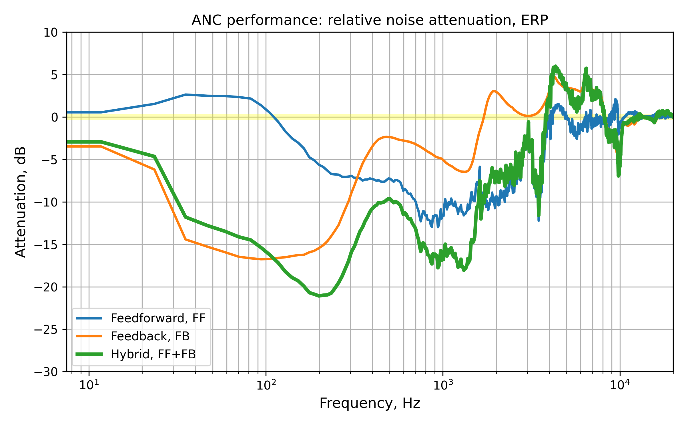

### Active noise control
**Active noise control** ([ANC](https://en.wikipedia.org/wiki/Active_noise_control)) - is a method for reducing unwanted sound by the addition of a second sound generated by an ANC controller to cancel the first. The two sounds cancel each other out by an effect which is called *destructive interference*.

We consider a task of designing an ANC system for **headphones**.

<center></center>

According to the control structure, controllers can be categorized into the [*feedforward*](https://en.wikipedia.org/wiki/Feed_forward_(control)) (FF) and [*feedback*](https://en.wikipedia.org/wiki/Closed-loop_controller) (FB) ones. The former one uses the signal from the reference microphone, while the latter one relies on the error signal coming from the error microphone. If an ANC system includes both controllers, it is usually called a *hybrid* system.

<center></center>

The controller synthesis problem can be formulated as a non-linear constrained optimization problem. 
The controller is synthesized from a dataset of measured impulse responses of a headphone system.

#### Controller representation

Typically, ANC systems use a linear, time-invariant or adaptive, digital filter with a [*finite impulse response*](https://en.wikipedia.org/wiki/Finite_impulse_response) (FIR) or an [*infinite impulse response*](https://en.wikipedia.org/wiki/Infinite_impulse_response) (IIR).

Compared to analog controllers, one problem of a digital controller is that an extra delay is introduced. Also, in the case of headphones, the distance between the reference microphone and the speaker does not exceed 1-1.5 cm. Both problems motivate using higher sampling frequency to reduce the latency, but it comes with the cost of increased computational burden, making the use of FIR based controllers impractical.

This problem could be alleviated with the usages of [*warped FIR*](https://www2.spsc.tugraz.at/people/franklyn/ICASSP97/pdf/scan/ic972205.pdf) filters or cascades of [*biquad*](https://en.wikipedia.org/wiki/Digital_biquad_filter) filters (2nd order IIR), the latter of which is particularly advantageous for commercial products since the controller cost could be greatly lowered and the battery lifetime could also be lengthened.

The biggest advantage of an IIR based controller is its reduced computational complexity. Each biquad filter only needs 5 multiplications and 4 additions per sample to calculate its output, and the total number of multiplications or additions is less than 100. This is several orders of magnitude less than for FIR based controllers. 

Based on this reduced computational complexity, the sampling frequency could be greatly increased up to are 192 kHz or 384 kHz (typical values in commercial chips) so that a much smaller controller delay could be obtained. Consequently, a better noise reduction performance could be expected due to enhanced system causality.


#### ANC system structure

To derive the transfer function of a hybrid ANC system, let's represent it as a signal flow graph:

<center></center>

List of abbreviations:

|Abbreviation|Definition|
|-|:-|
|ERP|Error reference point (error microphone location)|
|DRP|Drum reference point|
|REF|Reference microphone location|
|PP|Primary path|
|SP|Secondary path|
|FF|Feedforward controller|
|FB|Feedback controller|


Traditionally, an ANC system is tuned to produce optimum noise cancellation at the location of the error microphone, also called as the *error reference point* (ERP). This is because most of the ANC systems rely upon monitoring the cancelled signal to work. To maximize noise cancellation, an ideal placement of an error microphone would be at the eardrum. This point is often referred to as the *drum reference point* (DRP) . But that location is not practical or possible for many consumer devices. Thus, the ERP is used to provide a practical signal that is roughly indicative of the cancellation performance at the DRP, especially for lower frequencies (< 1 kHz). Also, sometimes it is considered acceptable to ignore any differences in noise cancellation between the ERP and the DRP.

Using [Mason's gain formula](https://en.wikipedia.org/wiki/Mason%27s_gain_formula), one can derive the transfer function:

$H = \frac{\sum_k \text{P}_k \Delta_k}{\Delta}$

that models the system's output $Y$ given the input $X$.


Graph determinant: $\Delta = 1 + \mathrm{FB} \cdot \mathrm{SP}_\text{ERP}$

Paths and co-factors: 
- $P_1 = G_\text{DRP}$, $\Delta_1 = 1 + \mathrm{FB} \cdot \mathrm{SP}_\text{ERP}$
- $P_2 = G_\text{REF} \cdot \mathrm{FF} \cdot \mathrm{SP}_\text{DRP}$, $\Delta_2 = 1$
- $P_3 = -G_\text{ERP} \cdot \mathrm{FB} \cdot \mathrm{SP}_\text{DRP}$, $\Delta_3 = 1$


Transfer function: 
```math
\begin{aligned}
H = \frac{Y_\text{DRP}}{X} = G_\text{DRP} + \frac{G_\text{REF} \cdot \mathrm{FF} \cdot \mathrm{SP}_\text{DRP} - G_\text{ERP} \cdot \mathrm{FB} \cdot \mathrm{SP}_\text{DRP}}{1 + \mathrm{FB} \cdot \mathrm{SP}_\text{ERP}} \\ 
= \frac{G_\text{DRP} + G_\text{REF} \cdot \mathrm{FF} \cdot \mathrm{SP}_\text{DRP} + G_\text{DRP} \cdot \mathrm{FB} \cdot \mathrm{SP}_\text{ERP} - G_\text{ERP} \cdot \mathrm{FB} \cdot \mathrm{SP}_\text{DRP}} {1 + \mathrm{FB} \cdot \mathrm{SP}_\text{ERP}} \\
= \frac{G_\text{DRP} + G_\text{REF} \cdot \mathrm{FF} \cdot \mathrm{SP}_\text{DRP} + \mathrm{FB} \cdot (G_\text{DRP} \cdot \mathrm{SP}_\text{ERP} - G_\text{ERP} \cdot \mathrm{SP}_\text{DRP})} {1 + \mathrm{FB} \cdot \mathrm{SP}_\text{ERP}} \\
= \frac{G_\text{DRP} + G_\text{REF} \cdot \mathrm{FF} \cdot \mathrm{SP}_\text{DRP} + \mathrm{FB} \cdot G_\text{DRP} \cdot \mathrm{SP}_\text{ERP} \cdot (1 - \frac{G_\text{ERP} \cdot \mathrm{SP}_\text{DRP}}{G_\text{DRP} \cdot \mathrm{SP}_\text{ERP}})} {1 + \mathrm{FB} \cdot \mathrm{SP}_\text{ERP}} \\
\end{aligned}
```


Introducing the *primary path* (PP) responses as $\mathrm{PP}_\text{ERP} = \frac{G_\text{ERP}}{G_\text{REF}}$, $\mathrm{PP}_\text{DRP} = \frac{G_\text{DRP}}{G_\text{REF}}$ and $\Delta = \frac{G_\text{ERP} \cdot \mathrm{SP}_\text{DRP}}{G_\text{DRP} \cdot \mathrm{SP}_\text{ERP}} = \frac{\mathrm{PP}_\text{ERP} \cdot \mathrm{SP}_\text{DRP}}{\mathrm{PP}_\text{DRP} \cdot \mathrm{SP}_\text{ERP}}$, the transfer function can be rewritten as:
```math
\frac{Y_\text{DRP}}{G_\text{REF} \cdot X} = \frac{\mathrm{PP}_\text{DRP} + \mathrm{FF} \cdot \mathrm{SP}_\text{DRP} + \mathrm{FB} \cdot \mathrm{PP}_\text{DRP} \cdot \mathrm{SP}_\text{ERP} \cdot (1 - \Delta)} {1 + \mathrm{FB} \cdot \mathrm{SP}_\text{ERP}}
```

Given this transfer function, one can can define the [*sensitivity function*](https://en.wikipedia.org/wiki/Sensitivity_(control_systems)) for a whole system - ratio of noise with ANC ON and ANC OFF:
```math
S = \frac{H}{G_\text{DRP}} = \frac{1 + \frac{\mathrm{SP}_\text{DRP}}{\mathrm{PP}_\text{DRP}} \cdot \mathrm{FF} + \mathrm{FB} \cdot \mathrm{SP}_\text{ERP} \cdot (1 - \Delta)} {1 + \mathrm{FB} \cdot \mathrm{SP}_\text{ERP}}
```
Let us assume that $\mathrm{ERP} \equiv \mathrm{DRP}$ for now. This simplifies the sensitivity function by eliminating $\mathrm{FB}$ from the numerator:
```math
S = \frac{1 + \frac{\mathrm{SP}_\text{ERP}}{\mathrm{PP}_\text{ERP}} \cdot \mathrm{FF}} {1 + \mathrm{FB} \cdot \mathrm{SP}_\text{ERP}}
```
Under this assumption, design of a hybrid ANC controller, - minimization of the sensitivity function $S$ wrt to $\mathrm{FF}$ and $\mathrm{FB}$, - decouples into two independent optimization problems. Next sections present detailed discussion about the controller design.


### Feedback controller design

Let consider a feedback control system with linear time-invariant stable plant $P$, defined by its frequency response.

The objective is to synthesize a linear time-invariant controller $K$ that achieves good noise attenuation within the control bandwidth.
This can be achieved by minimizing the *sensitivity function*, *i.e.*, the [*closed-loop*](https://en.wikipedia.org/wiki/Closed-loop_transfer_function) transfer function:
```math
S = \frac{1}{1 + K \cdot P} = \frac{1}{1 + L} 
```
In the case of feedback ANC, the plant is $P$ is given by the measured secondary path response(s). Here, $L$ denotes the *open-loop* transfer function. 

The design goal of minimizing the sensitivity function translates to making its magnitude, $∣S∣$, as small as possible over the target frequency range where noise attenuation is desired.

Beyond performance, the sensitivity function is intimately linked to system robustness. The peak magnitude of the sensitivity function, is a widely used indicator of robustness to variations or uncertainties in the plant model. Smaller values (typically constrained to be less than 6 dB) signify a more robust system.

Also, the sensitivity function characterizes the so-called *waterbed effect* (see below), a fundamental constraint in feedback control systems, including ANC. This phenomenon dictates that efforts to suppress the sensitivity function (attenuate noise) in one frequency band **inevitably** lead to an increase in its magnitude (noise amplification) in other frequency bands. Therefore, the design process must carefully balance the desired level of noise attenuation within the control bandwidth against acceptable levels of noise amplification outside this band.

In summary, the optimization problem for ANC controller synthesis effectively seeks an optimal shape for $∣S∣$ that balances these interconnected and conflicting requirements of performance, robustness, and limited out-of-band amplification.


##### Additional considerations
The following facts can be helpful for designing an ANC system for headphones.
- First, the human auditory system is less sensitive at low frequencies. See the [equal-loudness contours](https://en.wikipedia.org/wiki/Equal-loudness_contour). 
- Second, a headphone system damps ambient noise in the high frequency region, that is, the noise is already partially attenuated by passive sound isolation.

Based on these assumptions, the objective function for controller design may be altered to put less emphasis on certain frequency regions (low and high frequencies).  This can be done by using a weighed sensitivity function obtained by applying [frequency weighting](https://en.wikipedia.org/wiki/Weighting) to the sensitivity function. A suitable frequency weighting function can be defined based on properties of the human ear (for instance, see [A-weighting](https://en.wikipedia.org/wiki/A-weighting)) as well as the desired noise attenuation band.

Below in an illustration of weighting functions used for FF and FB controllers design.

<center></center>


#### Controller representation

In [^1] a method for designing an ANC controller represented as a FIR filter was proposed. The coefficients of the filter were found by solving a *convex optimization* problem. Despite convenience of the problem formulation and uniqueness of a solution, practical implementations of FIR controllers are usually restricted by their computational complexity. Therefore, IIR filters are usually preferred for implementing ANC controllers. Also, a cascade of 5-10 biquad filters can approximate a prescribed frequency response with reasonable accuracy, required for building a competitive ANC system. Here, **cascades of biquad filters** are used as the feedback and feedforward controllers, which is in accordance with the most commercial ANC headphones currently available on the market (2024). 

##### Filter parameterization

Instead of the general form represented with poles and zeros, several kinds of parametric biquad filters are considered here. See [^2] for details.


#### Stability constraints
According to the [Nyquist stability criterion](https://en.wikipedia.org/wiki/Nyquist_stability_criterion), a closed-loop system is stable iif the Nyquist curve of the open-loop transfer function does not encircle the point $-1+0i$. For ensuring this criterion we define forbidden regions in the complex plane.
In practice, it is not enough that a system is stable. There must be some margins of stability to describe its robustness to perturbation. There are several common stability measures defined as follows:
- **Stability margin** is a shortest distance from the Nyquist curve to the critical point $(-1, 0)$.
- **Gain margin** (GM) is a factor by which the gain of a stable system is allowed to increase before the system becomes unstable. It is the inverse of the distance between the origin and the point between $-1$ and $0$ where the Nyquist curve crosses the real axis.
- **Phase margin** (PM) is the amount of phase lag that a system can tolerate before becoming unstable. It is defined as the difference between $-180$ degrees and the phase angle of the open-loop transfer function at the frequency where the magnitude is $1$ ($0$ $\mathrm{dB}$).

The gain margin and phase margins on the [Nyquist plot](https://en.wikipedia.org/wiki/Nyquist_stability_criterion#Nyquist_plot):

<center></center>

In a practical situation a phase margin of 45° and a gain margin of 6 dB are often used.

One of the ways to define a constraint is the following:
```math
|1 - L(\omega)| - |1+L(\omega)| \leq 2a, \forall \omega \in [0, \infty)
```
This inequality defines a hyperbolicnd in the complex plane. This bound not only prevents $L$ from encirclement of the point $(-1, 0)$, but also provides the following stability margins:

```math
\begin{equation}
\begin{cases} 
\mathrm{GM} \geq a^{-1}\\
\mathrm{PM} \geq \cos^{-1}(a\sqrt{2-a^2})
\end{cases}
\end{equation}
```

Forbidden area (black) in the complex plane:

<center></center>

Another similar constraint can be defined based on a parabola in the complex plane:
```math
\mathfrak{R}\{L(\omega)\} \geq -d_1 \mathfrak{I}\{L(\omega)\}^2 - d_2
```

Forbidden area (black) in the complex plane:

<center></center>

Finally, physical systems generally have some high frequency plant uncertainty. For instance, a slight change in the system delay could cause a large phase variation in the high-frequency band. Thus, the open-loop gain should be small enough above $\omega_{h}$:
```math
|L(\omega)| \leq c, \forall \omega \in [\omega_{h}, \infty)
```


#### Performance constraints

According to [Bode's sensitivity integral theorem](https://en.wikipedia.org/wiki/Bode%27s_sensitivity_integral), there is a fundamental trade-off, known as the [*waterbed effect*](https://flyingv.ucsd.edu/krstic/teaching/143b/GSBode.pdf), between decreasing (below unity) the magnitude of the sensitivity function in some frequency regions and getting it increased (above unity) at the other frequency regions. 

<center></center>

Therefore, to avoid excessive noise amplification ($|S|>1$), some constraint must be included to prevent the magnitude of the sensitivity function of growing too large.
```math
|1 + L(\omega)| \geq b, \forall \omega \in [0, \infty)
```
This constraint defines a circular region with a radius $b$ centered at $(-1, 0)$. This bound ensures that the magnitude of the sensitivity function is below $b^{-1}$ and provides the following stability margins:

```math
\begin{equation}
\begin{cases} 
\mathrm{GM} \geq (1 - b)^{-1}\\
\mathrm{PM} \geq \cos^{-1}(1 - b^2/2)
\end{cases}
\end{equation}
```

#### Problem formulation

In summary, given the frequency response of the plant (secondary path), a feedback controller can be designed by solving a constrained optimization problem defined in the frequency domain. The problem includes the objective function defined by magnitude of the weighed sensitivity function, and the constraints outlined before.

Since continuous frequency responses cannot be directly handled by numerical optimization algorithms, they must be discretized. This involves evaluating the SP response, the controller response, and the weighting function at a finite set of discrete frequency points​. The objective function and all frequency-dependent constraints are then formulated based on these​ points. 
A critical aspect of this discretization is ensuring that the behavior of the system between these sample points remains acceptable. The number of frequency points, $N$, must be sufficiently large to adequately capture the variations in the frequency responses and to prevent undesirable phenomena. If it​ is too small, the controller might satisfy all criteria at the selected discrete points​, but exhibit poor performance or even instability due to large, undetected peaks or phase shifts in the sensitivity function or loop transfer function occurring between these points. However, increasing $N$, to improve the resolution of the frequency response comes at the cost of increased computational complexity. Each iteration of the optimization algorithm requires the evaluation of the objective function and all relevant constraints at each of the $N$ frequency points. For complex controllers or a large number of constraints, this can lead to prohibitively long optimization times.
To mitigate this trade-off between accuracy and computational burden, non-uniformly discretized spectra offer a promising approach [^3]. Instead of a uniform spacing of frequency points, this technique employs a variable density of points. More points are allocated to frequency regions deemed critical for the ANC system's performance or stability, while fewer points are used in less critical regions.

#### Solver

The optimization problem described above is highly non-convex since the controller has an IIR structure. 

Consequently, [metaheuristics](https://en.wikipedia.org/wiki/Metaheuristic) are often used for solving such problems. These algorithms aim to find a global (rather than local) optimum, and although they have no guarantee of good performance, they been found to perform acceptably in many use cases. Examples of such algorithms include evolutionary algorithms, particle swarm optimization, etc.

To use off-the-shelf metaheuristics available in open-source Python packages, the original optimization problem should be formulated as an unconstrained problem.

### Feedforward controller design

The key concept of the FF ANC system is that an upstream reference microphone is used to capture the noise (disturbance) *before* it reaches the control source (loudspeaker) and the desired cancellation point (error microphone). Based on the *time-advanced information* about the noise from the reference microphone, the FF ANC controller generates an antinoise signal that is equal in amplitude but opposite in phase to the disturbance signal, which is then emitted by the loudspeaker.
In the ideal case, *i.e.*, perfect cancellation, the ANC controller should correspond to the optimal transfer function of the FF ANC filter 
```math
\mathrm{FF} = -\frac{\mathrm{PP}}{\mathrm{SP}} 
```
where the primary path $\mathrm{PP}$ represents the acoustic response from the reference microphone to the cancellation point (ERP or DRP), the secondary path $\mathrm{SP}$ is the transfer function between the ANC controller output and the cancellation point.
So, the FF ANC filter has to model $\mathrm{PP}$ and the inverse of $\mathrm{SP}$, thus $\mathrm{FF}$ can only be realized if $\mathrm{SP}$ is a minimum phase and whereby a **stable and causal inverse exists**, which is usually not the case.

In practice, designing a feedforward ANC controller is technically similar to designing a feedback controller. In both cases one needs to minimize the magnitude of the sensitivity function $S$ wrt to either $\mathrm{FF}$ or $\mathrm{FB}$ parameters:
```math
S = \frac{1 + \frac{\mathrm{SP}_\text{ERP}}{\mathrm{PP}_\text{ERP}} \cdot \mathrm{FF}} {1 + \mathrm{FB} \cdot \mathrm{SP}_\text{ERP}}
```
However, in the case of FF ANC, the problem is usually unconstrained because the stability constraints are not required.

### Dataset

We used the data from the [PANDAR](https://www.iks.rwth-aachen.de/en/research/tools-downloads/databases/paths-for-active-noise-cancellation-development-and-research/) database of acoustic paths [^4], which provides impulse responses measured for multiple persons equipped with a Bose QC20 in-ear headphone.

<center></center>

See https://www.bose.com/pressroom/bose-quietcomfort-20-acoustic-noise-cancelling-headphones for details.

### Results

First, let's verify stability of the resulting feedback controller.

Assessment of the stability of a closed-loop negative feedback system is done by applying the Nyquist stability criterion to the Nyquist plot of the open-loop system (*i.e.* the same system without its feedback loop). A Nyquist plot is a parametric plot of a frequency response. In Cartesian coordinates, the real part of the transfer function is plotted on the x-axis while the imaginary part is plotted on the y-axis. The frequency is swept as a parameter, resulting in one point per frequency.  To determine closed-loop stability, the plot is analyzed for encirclements of the critical point $-1+0i$.

The Nyquist plot of the open-loop transfer function corresponding to the obtained feedback controller:

<center></center>

The Nyquist curve, shown as a dotted line, does not penetrate the forbidden region (black) assuring that the system is stable.

Next, given the synthesized controllers, one can assess the noise reduction performance of the resulting ANC system. The practical performance assessment involves measuring the acoustic noise at the DRP under two conditions: with the ANC system turned *off* and with the ANC system turned *on*. 

The *relative attenuation* (RA) is a widely used metric to quantify the performance of an ANC system in the frequency domain. It is a ratio of the power spectral density (PSD) of the error microphone signal with an ANC system turned *on* to the same PSD with ANC turned *off*, typically expressed in decibels (dB). A negative value of RA at a particular frequency indicates that the ANC system is reducing the noise power at that frequency. Conversely, a positive value indicates noise amplification.

Assuming that the system behaves linearly, the ratio of these PSDs is approximately equal to the squared magnitude of the sensitivity function$S$ at the corresponding frequency. 
```math
\mathrm{RA}(\mathrm{dB}) = 10 \log_{10} \frac{\mathrm{PSD}_\text{on}}{\mathrm{PSD}_\text{off}} \approx 10 \log_{10} |S|^2
```
Any significant discrepancies between the $∣S∣$ predicted by the optimization process and the experimentally measured RA can point to inaccuracies in the SP model used for design, unmodeled non-linearities, or limitations imposed by the controller's implementation (*e.g.*, quantization effects, processing delay).

Below is a result of running ANC system simulation.

<center></center>

Here, the curve labeled as FF+FB corresponds to the hybrid system, while the other curves show individual performance of each controller. 


### ANC controller design issues

Ultimately, the synthesis of an effective ANC controller is an iterative process. It often involves meticulous tuning of weighting functions in the objective, careful definition of constraint boundaries, and repeated optimization runs to navigate the complex trade-offs inherent in feedback control.

For practical design of an ANC system, one needs to consider several issues such as the measured data uncertainty and specifics of headphones wearing.


#### Plant uncertainty

The resulting ANC system depends on the secondary path and the primary path measurements. Both the secondary path and the primary path can vary according to the placement of the earpiece in the ear, the shape of the ear canal, the level of leakage, etc. The figure below shows variations of the secondary path responses estimated from different persons and a dummy head[^4].

<center></center>

In order to obtain a robust system, uncertainties of the plant (secondary path) need to be considered. The multiplicative uncertainty model is a common choice. It describes the plant by means of a multiplicative deviation from a nominal path [^5][^6][^7].

Multiplicative uncertainty model:

$S(\omega) = S_0(\omega)(1 + W(\omega) \cdot \Delta(\omega))$

Here, $\Delta$ is a subset of complex numbers that fulfills the condition $|\Delta(\omega)| \leq 1, \forall \omega$.

$W(\omega) = \max_i | \frac{S_i(\omega) - S_0(\omega)}{S_0(\omega)} |$

$S(\omega) = S_0(\omega)(1 + W(\omega) \cdot \Delta(\omega)) = S_0(\omega) + r\cdot\Delta(\omega)$

$r = S_0(\omega) \max_i | \frac{S_i(\omega) - S_0(\omega)}{S_0(\omega)} | \approx \max_i | S_i(\omega) - S_0(\omega) |$

...<u>work in progress</u>!

#### ERP vs DRP

In the discussion above the ANC performance was generally evaluated at the error microphone location, aka the error reference point (ERP).
However, the residual error signal at the ERP might be different from the one perceived by the human ear at the eardrum, aka the drum reference point  (DRP).
There are studies, where the ERP vs. DRP mismatch is addressed for an ANC system design [^8].

...<u>work in progress</u>!

### References

[^1]: **Rafaely, B., & Elliott, S. J.**  (1999). *$H_2/H_∞$ Active Control of Sound in a Headrest: Design and Implementation.*
[^2]:  **Nercessian, S., Sarroff, A. M., & Werner, K. J.**  (2021). *Lightweight and Interpretable Neural Modeling of an Audio Distortion Effect Using Hyperconditioned Differentiable Biquads.*
[^3]:  **Klatt, W. A., Burger, M., Martin, R., & Puder, H.**  (2024). *Filter Synthesis for Robust Feedback Active Noise Control using Non-Uniformly Discretized Fourier Spectra.*
[^4]: **Liebich, S., Fabry, J., Jax, P., & Vary, P.**  (2019). *Acoustic Path Database for ANC In-Ear Headphone Development.*
[^5]: **Hua, Y., & Peng, L.** (2024). *Uncertainty Constraint on Headphone Secondary Path Function for Designing Cascade Biquad Feedback Controller with Improved Noise Reduction Performance.*
[^6]: **Benois, P.R., Zölzer, U.** (2019). *Psychoacoustic Optimization of a Feedback Controller for Active Noise Cancelling Headphones.*
[^7]: **Klatt, W. A., & Martin, R.**  (2025). *Control Filter Design with Convex-Set-Based Uncertainty Model for Robust Feedback Active Noise Control.*
[^8]: **An, F., Wu, Q., & Liu, B.**  (2022). *Feedback Controller Optimization for Active Noise Control Headphones Considering Frequency Response Mismatch between Microphone and Human Ear.*